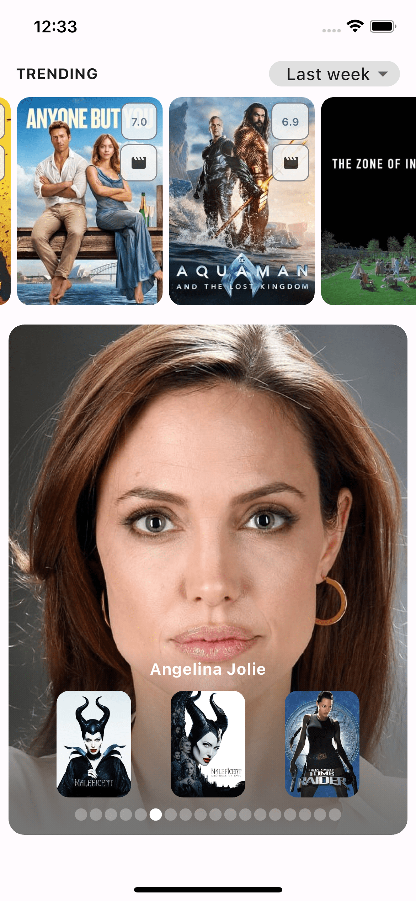
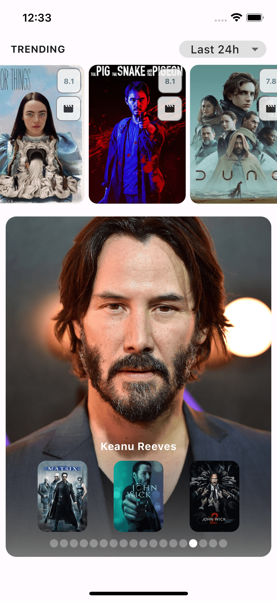

# Movie App (Clean Architecture)

#### En proceso de desarrollo

## Descripción

Este proyecto tiene como objetivo construir una aplicación móvil utilizando la arquitectura limpia (Clean Architecture) en Flutter. Está diseñado para ser escalable y mantenible. Para el manejo de estado, se utiliza el paquete **Provider**, que facilita la gestión de la UI y la lógica de negocio de forma eficiente.

La aplicación está estructurada de acuerdo a los principios de la arquitectura limpia, separando las capas de presentación, dominio y datos. Esto permite una fácil expansión y mantenimiento a largo plazo.

### Estructura del Proyecto

- `lib/`:
  - **data/**: Contiene las implementaciones de los repositorios, fuentes de datos, y modelos.
  - **domain/**: Contiene las entidades, casos de uso y las interfaces para los repositorios.
  - **presentation/**: Contiene las vistas, bloques de lógica de la UI y los proveedores.
  - **core/**: Elementos comunes como servicios, utilidades y configuraciones.

- `assets/`: Recursos estáticos como imágenes y archivos SVG.
- `env/`: Archivos de configuración (por ejemplo, `.env`).

### Dependencias y Herramientas

Este proyecto usa varias dependencias esenciales como:

- **Provider**: Para la gestión de estado.
- **json_serializable**: Para la serialización de JSON.
- **flutter_dotenv**: Para la configuración de variables de entorno.

## Requisitos

Antes de ejecutar el proyecto, asegúrate de tener las siguientes herramientas instaladas:

- **Flutter** (utilizando FVM)
- **Dart** (version compatible con el SDK de Flutter)
- **Dependencias necesarias** definidas en el `pubspec.yaml`

## Configuración del `pubspec.yaml`

El archivo `pubspec.yaml` del proyecto incluye las siguientes dependencias y configuraciones:

```yaml
name: movie_app

publish_to: 'none'

version: 1.0.0+1

environment:
  sdk: ^3.5.3

dependencies:
  connectivity_plus: ^6.0.5
  cupertino_icons: ^1.0.2
  equatable: ^2.0.5
  extended_image: ^8.1.1
  extended_image_library: ^4.0.4
  flutter:
    sdk: flutter
  flutter_dotenv: ^5.0.2
  flutter_secure_storage: ^8.0.0
  flutter_svg: ^2.0.10+1
  freezed_annotation: ^2.2.0
  google_fonts: ^6.2.0
  http: ^1.0.0
  json_annotation: ^4.8.1
  provider: ^6.0.5
  shared_preferences: ^2.2.3
  url_strategy: ^0.2.0

dev_dependencies:
  build_runner: ^2.4.5
  flutter_gen: ^5.4.0
  flutter_gen_runner: ^5.4.0
  flutter_test:
    sdk: flutter
  freezed: ^2.3.5
  json_serializable: ^6.7.0
  flutter_lints: ^4.0.0

flutter:
  uses-material-design: true
  assets:
    - assets/images/
    - assets/svgs/
    - .env

flutter_gen:
  output: lib/app/generated/
  integrations:
    flutter_svg: true
```

### Uso de FVM (Flutter Version Manager)

Este proyecto usa **FVM** para gestionar versiones específicas de Flutter. La versión actual de Flutter utilizada en el proyecto es la **3.24.3**. Para asegurarte de usar la misma versión de Flutter, sigue estos pasos:

1. **Instalar FVM** (si no lo tienes instalado):

   ```bash
   pub global activate fvm
   ```

2. **Instalar la versión específica de Flutter**:

   ```bash
   fvm install 3.24.3
   ```

3. **Usar la versión de Flutter configurada en el proyecto**:

   ```bash
   fvm use 3.24.3
   ```

4. **Verificar que la versión está configurada correctamente**:

   ```bash
   fvm flutter --version
   ```

Con FVM, puedes asegurarte de que el proyecto siempre utilice la versión correcta de Flutter, lo que facilita la colaboración y evita problemas de compatibilidad.

---

## Pasos para la ejecución o despliegue

1. **Obtenemos o actualizamos todas las dependencias**:

   ```bash
   flutter pub get
   ```

2. **Generamos los archivos de código con `json_serializable`**:

   ```bash
   flutter pub run flutter_gen:flutter_gen_command
   flutter pub run build_runner build
   ```

---

## Variables de entorno

Asegúrate de tener el archivo `.env` en la raíz del proyecto con las siguientes variables:

```env
BASE_URL=https://api.themoviedb.org/3
TMDB_KEY=your_api_key
```

Reemplaza `your_api_key` con tu propia clave API de The Movie Database (TMDb).

---

| Last Week   | Last 24Hs  |
| --- | --- |
|   |  |

### Notas adicionales

- La configuración de **FVM** garantiza que estés usando la versión correcta de Flutter para el proyecto.
- El archivo `.env` es esencial para manejar configuraciones sensibles, como la clave API de TMDb.
- La dependencia `build_runner` se utiliza para generar código de forma automática, como en el caso de `json_serializable`.

## Contáctame

No dudes en comunicarte conmigo si tienes alguna pregunta, comentario u oportunidad de colaboración:

- **Correo electrónico**: [osramirezf@gmail.com]
- **LinkedIn**: [[Perfil de LinkedIn](https://www.linkedin.com/in/oscar-ramirez-franco/)]
- **GitHub**: [[Perfil de GitHub](https://github.com/OdaFra)]

### ¡Conectémonos y construyamos algo increíble juntos
